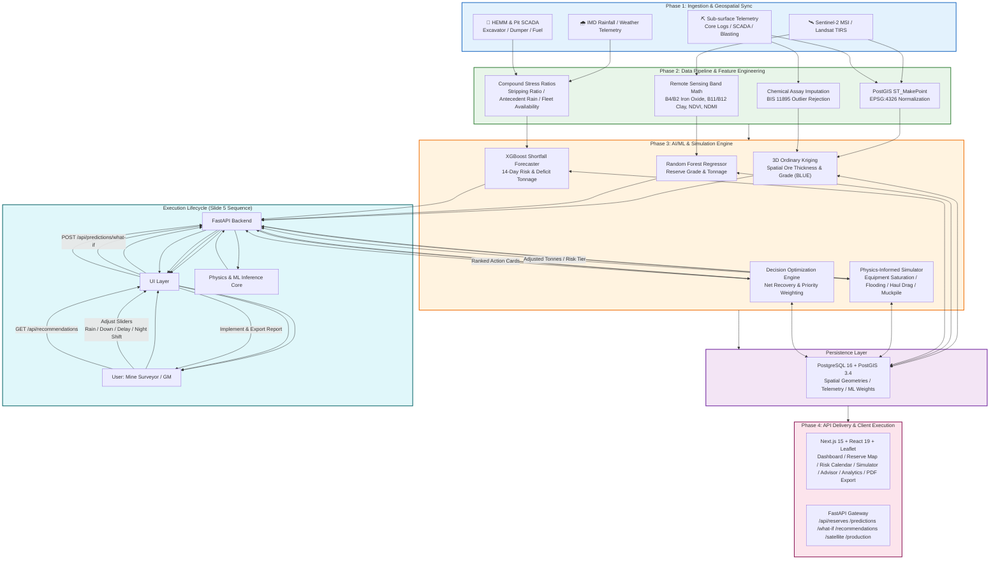

# MOIL Execution Flow — Full Project Lifecycle

## Key Phases Reference (from Presentation.md)

| Phase | Source Slide | Core Activity |
|---|---|---|
| **Ingestion** | Slide 5 / 6 | Satellite imagery + telemetry normalization into PostGIS |
| **Cleaning** | Slide 6 | Band math, assay imputation, compound stress ratios |
| **Kriging** | Slide 8 | 3D Ordinary Kriging for block grades / variograms |
| **Forecast** | Slide 9 | XGBoost / RF regressor: 14-day deficit prediction ($R^2$ 0.88–0.93) |
| **What-If** | Slide 10 | Physics-informed simulator (equipment saturation, flood thresholds, haul drag) |
| **Prescription** | Slide 11 | Prioritized action cards (redeployment, stockpile, rescheduling, maintenance, dewatering) |
| **Visualization** | Slide 12 | Leaflet 2.5D maps + thermal heatmaps + PDF export |
| **Deployment** | Slide 15 | Docker Compose (Next.js 3000 / FastAPI 8000 / PostgreSQL 16) |

---
*Derived from Presentation.md — Slides 4 (Architecture), 5 (Execution Lifecycle), 6 (Data Pipeline), 8–12 (Engines), 15 (Deployment).* | File: `ProjectExecutionFlow.md`
