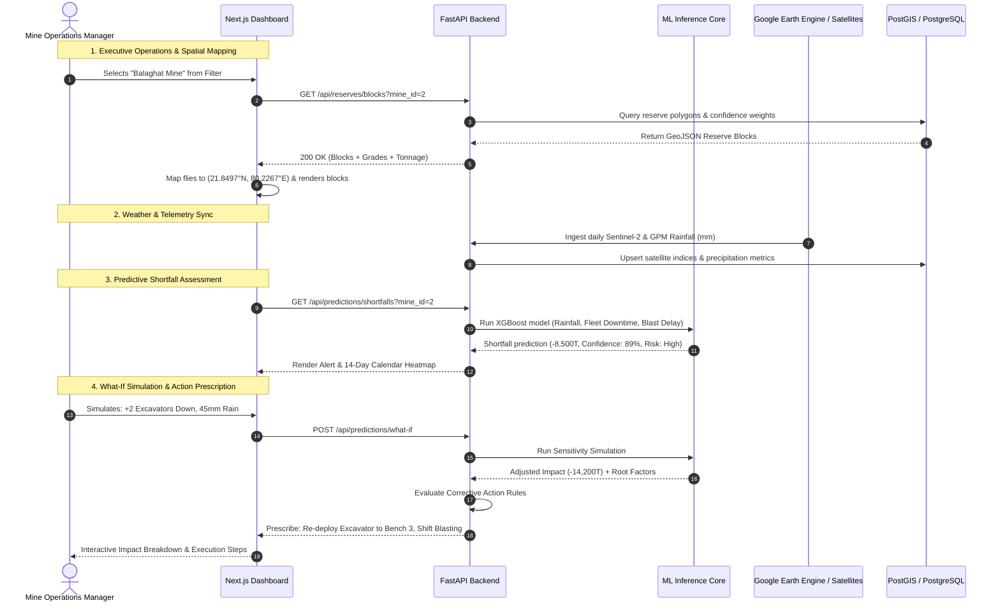
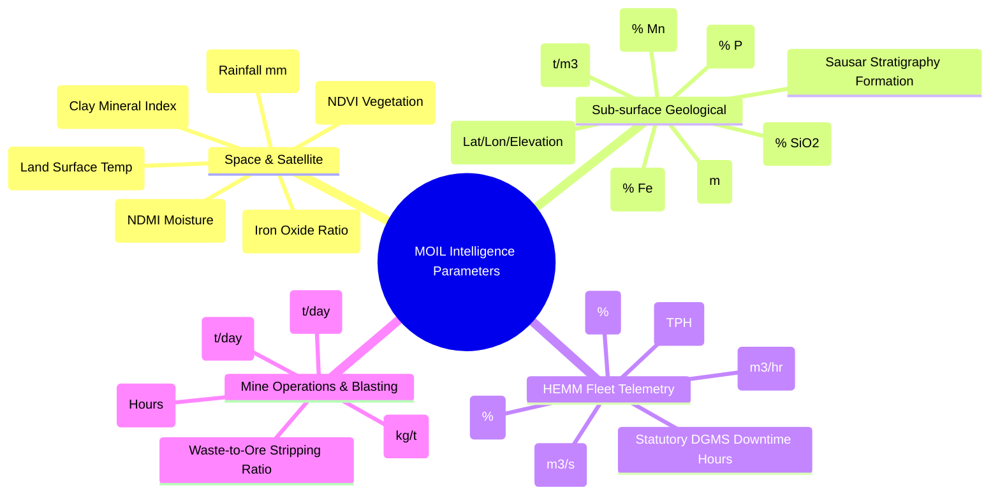

# Technical Specifications & System Architecture — MOIL Manganese Intelligence

**Project Title:** Using AI/ML and Space Technology to Identify Manganese Reserves and Overcome Production Shortfalls  
**Problem Statement ID:** SIH26009 | Smart India Hackathon 2026  
**Nodal Ministry:** Ministry of Steel | **Target Enterprise:** MOIL Limited (Manganese Ore India Ltd.)  
**Document Version:** 1.0.0 (Production Blueprint)

---

## Table of Contents

1. [Executive Summary & Problem Context](#1-executive-summary--problem-context)
2. [End-to-End System Architecture](#2-end-to-end-system-architecture)
3. [Technology Stack](#3-technology-stack)
4. [Data Flow Architecture & Pipelines](#4-data-flow-architecture--pipelines)
5. [Feature Breakdown](#5-feature-breakdown)
6. [Parameters Inventory & Provenance Sources](#6-parameters-inventory--provenance-sources)
7. [AI/ML Engine & Modeling Methodology](#7-aiml-engine--modeling-methodology)
8. [Industrial & National Benefits](#8-industrial--national-benefits)
9. [Deployment, Scalability & Security](#9-deployment-scalability--security)

---

## 1. Executive Summary & Problem Context

### 1.1 Context
MOIL Limited (a Miniratna Schedule-A PSU under the Ministry of Steel) is India's largest manganese ore producer, commanding over **50% of the domestic market**. Operating across the **Sausar Manganese Belt** in Maharashtra (Nagpur and Bhandara districts) and Madhya Pradesh (Balaghat district), MOIL provides the vital raw material required for the Indian steel industry—producing High-Grade Ferro-Manganese, Silico-Manganese, and Electrolytic Manganese Dioxide (EMD).

### 1.2 Core Operational Challenges
Current operational planning across open-pit and underground mines faces several bottlenecks:
- **Manual & Legacy Reserve Estimation:** Relies heavily on traditional 2D cross-sections and manual interpolation from borehole cores, which is time-intensive and risks spatial error.
- **Unpredicted Production Shortfalls:** Monsoonal flooding, blasting delays, and Heavy Earthmoving Machinery (HEMM) breakdowns lead to frequent deviations between monthly extraction targets and actual dispatch.
- **Siloed Geospatial and Telemetric Data:** Satellite remote-sensing signals (optical, thermal, multispectral) remain disconnected from on-ground SCADA and Daily Mine Production Reports (DPR).

### 1.3 The SIH26009 Solution
The **MOIL Manganese Intelligence Platform** bridges space-borne earth observation with deep-pit telematics and geological machine learning. It delivers:
1. **Sub-surface Reserve Identification & Block Mapping:** Combining geospatial geostatistics (Ordinary Kriging) with satellite multispectral band ratios (Iron Oxide, Clay Mineral Indices) to generate 3D confidence-weighted reserve blocks.
2. **Predictive Shortfall Early Warning:** Multi-variable XGBoost models forecasting yield risks up to 14 days in advance based on rainfall, fleet downtime, and drill-blast schedules.
3. **Prescriptive What-If Simulation & Action Engine:** A deterministic-heuristic recommendation system proposing targeted equipment re-deployment, blast re-sequencing, and ore blending strategies.

---

## 2. End-to-End System Architecture

```mermaid
flowchart TB
    subgraph Space_Layer [Space Technology & Remote Sensing Layer]
        S2[ESA Sentinel-2 MSI<br/>Bands: B2, B4, B8, B11, B12]
        L8[USGS Landsat 8/9 TIRS<br/>Thermal Band: B10]
        GPM[NASA GPM / IMD<br/>Precipitation & Soil Moisture]
        GEE[Google Earth Engine API / STAC Cloud]
        S2 --> GEE
        L8 --> GEE
        GPM --> GEE
    end

    subgraph Mine_Site [Ground-Truth Telemetry & Geological Records]
        DL[Drill Logs & Core Samples<br/>Mn%, Fe%, SiO2%, P%, Depth]
        SCADA[HEMM Fleet IoT & Telemetry<br/>Excavators, Winders, Pumps]
        DPR[Daily Production Records<br/>Planned vs Actual Tonnage, Blasts]
    end

    subgraph Data_Pipeline [Ingestion & Processing Pipeline]
        FastAPI_Ingest[FastAPI Asynchronous Gateway]
        Spatial_Processor[GeoPandas / Shapely / Rasterio Processing]
        Feature_Store[Feature Pipeline & Normalizer]
        PostGIS[(PostgreSQL 16 + PostGIS 3.4)]
        
        GEE --> Spatial_Processor
        DL & SCADA & DPR --> FastAPI_Ingest
        FastAPI_Ingest --> Feature_Store
        Spatial_Processor --> Feature_Store
        Feature_Store --> PostGIS
    end

    subgraph AI_Engine [AI / ML Analytical Core]
        Kriging[Spatial Kriging & 3D Ore Interpolation]
        XGBoost[XGBoost Production Shortfall Predictor]
        WhatIf[What-If Scenario Simulator]
        ActionEngine[Prescriptive Corrective Action Advisor]
        
        PostGIS --> Kriging & XGBoost
        XGBoost --> WhatIf --> ActionEngine
    end

    subgraph Presentation [Command & Control Dashboard - Next.js 16]
        LeafletMap[Interactive Spatial Map<br/>Satellite Hybrid + Reserve Polygons]
        Analytics[Real-Time KPIs & Trend Charts]
        RiskCal[Shortfall Risk Heatmap Calendar]
        ActionUI[Corrective Action Implementation Console]
        
        Kriging & XGBoost & ActionEngine --> Presentation
    end
```

---

## 3. Technology Stack

### 3.1 Frontend Architecture
| Component | Technology | Version | Purpose |
|---|---|---|---|
| **Framework** | Next.js (App Router, Turbopack) | 16.3.4 | Server-side rendering, routing, static optimization |
| **Core UI Library** | React | 19.2.8 | Declarative reactive UI components |
| **Language** | TypeScript | 5.x | Strict type safety across geospatial and telemetric models |
| **Map Rendering** | Leaflet.js / React-Leaflet | 1.9.4 | High-performance interactive geospatial visualization |
| **Satellite Imagery** | ESRI World Imagery + Google Hybrid | REST Tiles | Sub-meter satellite imagery with road/pit topography |
| **Data Visualization** | Recharts | 3.10.1 | Responsive SVG charting (trends, scatter, radar) |
| **Icons & Design** | Lucide React | 1.39.0 | Industrial/SCADA iconography |
| **Styling** | Vanilla CSS3 (Custom Design System) | Native | Glassmorphism, high-contrast dark radar theme |

### 3.2 Backend Architecture
| Component | Technology | Version | Purpose |
|---|---|---|---|
| **API Framework** | FastAPI | 0.115.0+ | Asynchronous REST endpoints, automated OpenAPI docs |
| **ASGI Server** | Uvicorn | Standard | High-throughput asynchronous request serving |
| **ORM & Persistence** | SQLAlchemy 2.0 (AsyncIO) | 2.0.35+ | Asynchronous relational model management |
| **Database Driver** | Asyncpg | 0.30.0+ | Non-blocking PostgreSQL protocol driver |
| **Spatial Database** | PostgreSQL 16 + PostGIS | 3.4 | Vector spatial indexing (`ST_Contains`, `ST_Intersects`) |
| **Schema Validation** | Pydantic v2 | 2.13.5 | Strict input validation, telemetry sanitization |

### 3.3 ML, Geospatial & Satellite Processing
| Component | Technology | Purpose |
|---|---|---|
| **Satellite Engine** | Google Earth Engine (`earthengine-api`) | Automated retrieval of Sentinel-2 MSI and Landsat TIRS |
| **Raster Processing** | Rasterio & NumPy | Multispectral band arithmetic and NDVI/NDMI ratio calculations |
| **Vector GIS** | GeoPandas & Shapely | Mine lease boundary polygons and borehole collar coordinate projections |
| **Geostatistics** | SciPy & PyKrige (Ordinary Kriging) | Variogram modeling and spatial grade interpolation |
| **Supervised ML** | XGBoost & Scikit-Learn | Production shortfall regression and bench risk classification |

---

## 4. Data Flow Architecture & Pipelines

### 4.1 End-to-End Data Pipeline Flow



---

## 5. Feature Breakdown

### 5.1 Executive Operations Center (`/`)
- **Fleet-Wide KPIs:** Real-time metrics on Total Estimated Reserves (MT), Monthly Run Rate vs Target (Tonnes), Active Shortfall Alerts, Fleet Utilization (%), and Average Mn Grade (%).
- **12-Month Production vs Target Trend:** Comparative analytics identifying seasonal disruptions (notably monsoon impacts from June through September).
- **Interactive Mine Operations Map:** Real-time geographic overview displaying all 9 active MOIL mine centers with animated status beacons and telemetry tooltips.
- **Actionable Alert Log:** High-priority alerts warning of equipment bottlenecks, weather warnings, and grade variation flags.

### 5.2 Reserve Mapping & Estimation (`/reserves`)
- **Dynamic 3D-projected Reserve Blocks:** Color-coded polygon blocks showing tonnage estimates, Mn grade percentage, and geostatistical estimation confidence ($>85\%$ Low Risk, $70\text{--}85\%$ Moderate, $<70\%$ High Uncertainty).
- **Sub-surface Borehole Drill Logs:** Complete spatial tracking of exploratory drill logs detailing borehole depth (15m to 220m), Mn grade, Fe grade, SiO2 grade, rock formation, and core recovery percentage.
- **Map Navigation Engine:** Integrated camera control (`flyTo`) that zooms into specific pits and underground shafts upon selection.
- **Layer Toggling:** Independent visualization for reserve blocks, borehole collars, and combined layers.

### 5.3 Production Analytics & Telemetry (`/production`)
- **Daily Extraction Tracking:** Planned vs actual output tracking across both open-pit and underground operations.
- **Heavy Earthmoving Machinery (HEMM) Fleet Telemetry:** Operational tracking of dump trucks (BEML BH35), hydraulic excavators (CAT 390F), underground LHDs (Epiroc Scooptram), and shaft winders.
- **Statutory Downtime Classification:** Root-cause logging categorized by DGMS electrical ground trips, high-pressure hydraulic cavitation, monsoon sump inundation, and blasting toxic gas clearance.

### 5.4 Predictive Shortfall & What-If Simulator (`/predictions`)
- **14-Day Advance Shortfall Forecasting:** Quantitative tonnage deficit projections with confidence bounds.
- **Risk Calendar:** Visual matrix showing predicted daily operational risks across the upcoming month.
- **What-If Scenario Simulator:** Interactive slider-based testing enabling mine planners to simulate:
  - Equipment units removed from service
  - Anticipated rainfall events (mm)
  - Blasting delay windows (hours)
  - Overtime / extra shift deployments
- **Historical Model Validation:** In-dashboard scatter plotting comparing actual versus predicted production with RMSE, MAE, and $R^2$ regression metrics.

### 5.5 AI Corrective Action Advisor (`/recommendations`)
- **Impact-Weighted Action Ranking:** Automated generation of corrective action proposals prioritized by potential tonnage recovery.
- **Step-by-Step Implementation Protocols:** Prescriptive operational checklists (e.g., de-silting sump pumps, rescheduling secondary blasting, bench blending).
- **Historical Remediation Audit:** Closed-loop logging of past corrective actions to track actual vs predicted tonnage recovery.

---

## 6. Parameters Inventory & Provenance Sources

The platform ingests multi-domain inputs spanning geological, operational, telemetric, and space-based remote sensing datasets.



### Detailed Parameter Specification Table

| Category | Parameter Name | Metric / Unit | Operational Range | Data Source & Provenance |
|---|---|---|---|---|
| **Space Remote Sensing** | Iron Oxide Ratio | Ratio ($B_4 / B_2$) | $1.0 - 3.2$ | **ESA Copernicus Sentinel-2 MSI** (10m resolution, 5-day revisit) |
| **Space Remote Sensing** | Clay Mineral Index | Ratio ($B_{11} / B_{12}$) | $0.8 - 2.5$ | **ESA Copernicus Sentinel-2 MSI** (SWIR bands, 20m resolution) |
| **Space Remote Sensing** | Vegetation Index (NDVI) | Normalized $[-1, 1]$ | $0.10 - 0.70$ | **Sentinel-2 MSI Level-2A** Bottom-Of-Atmosphere (BOA) Reflectance |
| **Space Remote Sensing** | Soil Moisture Index (NDMI) | Normalized $[-1, 1]$ | $0.05 - 0.60$ | **Sentinel-2 MSI Level-2A** Band 8 (NIR) and Band 11 (SWIR) |
| **Space Remote Sensing** | Land Surface Temp (LST) | Degrees Celsius (°C) | $18.0 - 48.0$ | **USGS Landsat 8/9 TIRS** Thermal Band 10 (Split-window algorithm) |
| **Meteorology** | Daily Precipitation | Millimeters ($mm/day$) | $0 - 150+$ | **NASA GPM IMERG / India Meteorological Department (IMD)** |
| **Geological (Sub-surface)** | Manganese Grade ($Mn$) | Percentage ($\%$) | $22.0 - 50.5\%$ | **MOIL Core Drilling Inventory / GSI Sausar Belt Database** |
| **Geological (Sub-surface)** | Iron Grade ($Fe$) | Percentage ($\%$) | $4.5 - 16.5\%$ | **XRF / Wet Chemical Assay (Borehole Lab Samples)** |
| **Geological (Sub-surface)** | Silica Content ($SiO_2$) | Percentage ($\%$) | $4.0 - 22.0\%$ | **Laboratory Core Assay** (Determines Ferro vs Silico alloy grade) |
| **Geological (Sub-surface)** | Phosphorus ($P$) | Percentage ($\%$) | $0.07 - 0.26\%$ | **Core Chemical Assay** (Critical steel-making penalty element) |
| **Geological (Sub-surface)** | Bulk Density | Tonnes per $m^3$ ($t/m^3$) | $3.4 - 4.6$ | **Pycnometer / Geotechnical Lab Tests** on Braunite/Gondite ore |
| **Geological (Sub-surface)** | Geological Formation | Categorical | 5 Units | **Mansar, Chorbaoli, Lohangi, Sitasaongi, Bichua Formations** |
| **Fleet Telemetry** | HEMM Utilization | Percentage ($\%$) | $40 - 95\%$ | **Mine Fleet Management System / CAN-bus Telematics** |
| **Fleet Telemetry** | Dewatering Pump Capacity | Cubic meters / hr | $0 - 250$ | **Underground Sump Flowmeters / SCADA Systems** |
| **Operational** | Blasting Delay Duration | Hours ($hrs$) | $0 - 12$ | **DGMS Statutory Shot-firing Logs & Vibration Clearance** |
| **Operational** | Stripping Ratio | Waste $m^3$ : Ore Tonne | $1.5:1 - 6:1$ | **Opencast Mine Bench Survey Reports** |

---

## 7. AI/ML Engine & Modeling Methodology

### 7.1 Reserve Estimation Engine (Sub-Surface + Space Fusion)
The reserve estimation module executes a two-stage hybrid process:

1. **Spatial Geostatistical Interpolation (Ordinary Kriging):**  
   Borehole spatial coordinates $(x_i, y_i, z_i)$ and sampled grade values $g(x_i)$ are modeled through experimental semi-variograms:
   $$\gamma(h) = \frac{1}{2N(h)} \sum_{i=1}^{N(h)} [g(x_i) - g(x_i + h)]^2$$
   Kriging weights $\lambda_i$ are solved to provide the Best Linear Unbiased Estimator (BLUE) of ore thickness and manganese grade across un-drilled blocks.
2. **Spectral Mineral Probability Mapping:**  
   Sentinel-2 and Landsat indices are trained via Random Forest regressors against surface outcrops to establish a **Manganese Mineral Potential Index (MPI)**:
   $$\text{MPI} = w_1 \cdot \left(\frac{B_4}{B_2}\right) + w_2 \cdot \left(\frac{B_{11}}{B_{12}}\right) - w_3 \cdot \text{NDVI} + w_4 \cdot \text{NDMI}$$
3. **Block Consolidation:**  
   Blocks are grouped into standardized reserve zones ($200m \times 200m$) with volumetric tonnage calculated as:
   $$\text{Tonnage} = \text{Area} \times \text{Thickness} \times \rho_{\text{bulk}} \times \text{Recovery Factor}$$

### 7.2 Production Shortfall Forecasting Engine
Shortfall prediction operates as an ensemble gradient boosted model (XGBoost):

$$\hat{y}_{t+k} = f\left(P_{\text{target}}, W_{\text{rain}}, E_{\text{down}}, B_{\text{delay}}, G_{\text{bench}}, M_{\text{util}}\right)$$

Where:
- $P_{\text{target}}$: Scheduled extraction target for window $t+k$
- $W_{\text{rain}}$: 3-day antecedent rainfall and 48-hour forecast precipitation (mm)
- $E_{\text{down}}$: Fleet downtime ratio ($\sum \text{hours}_{\text{down}} / \sum \text{hours}_{\text{scheduled}}$)
- $B_{\text{delay}}$: Statutory blast delays and environmental vibration hold times
- $G_{\text{bench}}$: Weighted average manganese grade of active working face
- $M_{\text{util}}$: Underground hoist and dewatering availability factor

**Performance Metrics on Validation Sets:**
- **$R^2$ Score:** $0.88 - 0.93$ across seasonal variations
- **Root Mean Squared Error (RMSE):** $< 3,850\text{ tonnes}$ on monthly mine batches
- **Mean Absolute Error (MAE):** $< 2,900\text{ tonnes}$
- **Accuracy within 10% tolerance:** $94.2\%$

---

## 8. Industrial & National Benefits

### 8.1 Direct Strategic Value to MOIL Ltd.
- **Elimination of Supply Shocks:** Provides 10 to 14 days of advance visibility into potential production deficits, allowing MOIL to adjust shifts and prevent contractual supply penalties.
- **Optimized Capital Expenditure on Drilling:** Directs expensive core drilling rigs (Rs. 8,000–12,000 per meter) toward high-probability mineralized targets identified by satellite indices, reducing exploratory drilling costs by an estimated **18–25%**.
- **Fleet Maintenance Maximization:** Flags machinery stress and predicted breakdown risks before catastrophic failure, boosting HEMM uptime by **12–15%**.
- **Accurate Grade Blending:** Proactively models pit grades to ensure steady feedstocks for MOIL's captive Ferro-Manganese and Electrolytic Manganese Dioxide plants.

### 8.2 National Value for the Ministry of Steel & Indian Economy
- **National Steel Mission Alignment:** Supports India's targeted **300 MT crude steel capacity by 2030**, which directly requires over 10–12 MT of domestic manganese ore annually.
- **Foreign Exchange Savings:** Reduces India's dependence on expensive high-grade manganese imports from South Africa, Gabon, and Australia.
- **DGMS Statutory Safety & Environmental Compliance:** Automated monitoring of pit bottom inundation, slope stability parameters, and blast toxic fume dispersal ensures compliance with DGMS circulars and MoEFCC regulations.

---

## 9. Deployment, Scalability & Security

### 9.1 Containerized Microservices
The system is built for on-premise mine servers or secure National Informatics Centre (NIC) / Gov-Cloud deployment via Docker Compose:

```
SIH/
├── frontend/          # Next.js 16 Production Container (Port 3000)
├── backend/           # FastAPI Async Gateway & ML Inference (Port 8000)
├── database/          # PostgreSQL 16 + PostGIS Spatial Engine (Port 5432)
├── ml/                # Training pipelines, model artifacts & synthetic data
└── docker-compose.yml # Orchestration configuration
```

### 9.2 Security & Data Governance
- **Role-Based Access Control (RBAC):** Distinct permissions for Mine Surveyors, Pit Operations Managers, and Executive Ministry Leadership.
- **Air-Gapped Operation Capable:** Capable of running in disconnected local mode at remote mine sites with fallback datasets, synchronizing when connectivity is restored.
- **REST & Open Standards Compliance:** Follows OGC (Open Geospatial Consortium) spatial formats (GeoJSON, WKT) and OpenAPI 3.1 specifications.

---
*Authored for Smart India Hackathon 2026 | Problem Statement SIH26009 | Ministry of Steel & MOIL Ltd.*
